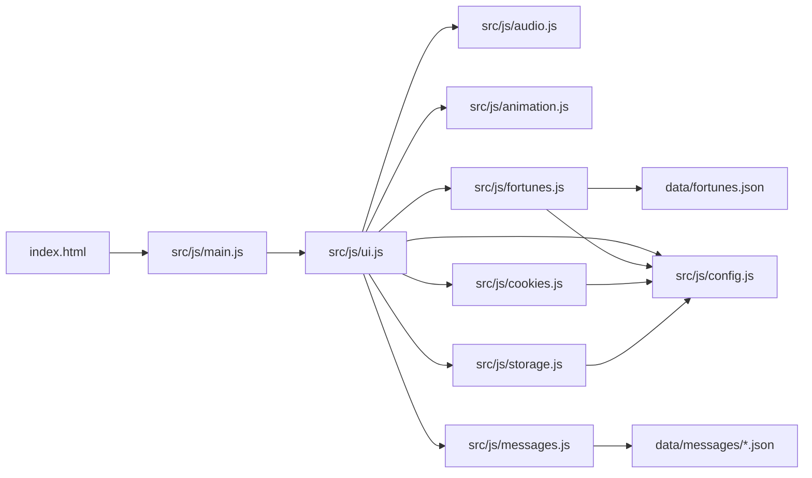

# Diagrama de dependências (Mermaid)

```mermaid
graph LR
  indexHTML[index.html] --> mainJS[src/js/main.js]
  mainJS --> uiJS[src/js/ui.js]
  uiJS --> audioJS[src/js/audio.js]
  uiJS --> animJS[src/js/animation.js]
  uiJS --> fortunesJS[src/js/fortunes.js]
  uiJS --> messagesJS[src/js/messages.js]
  uiJS --> storageJS[src/js/storage.js]
  uiJS --> cookiesJS[src/js/cookies.js]
  uiJS --> configJS[src/js/config.js]
  fortunesJS --> fortunesData[data/fortunes.json]
  fortunesJS --> configJS
  messagesJS --> msgData[data/messages/*.json]
  cookiesJS --> configJS
  storageJS --> configJS
```

Use em conversas com IA para dar visão macro sem colar código.***
